# Hello World MCP Example

## Pre-requisites

- [uv](https://github.com/astral-sh/uv) (Fast Python package installer and resolver)

## Setup

Install dependencies:
- ruff install info at https://docs.astral.sh/ruff/installation/
```bash
uv pip install -e ".[dev]" && uv sync
```

## Running the Server

Run the MCP server (configured to use SSE transport):

```bash
uv run src/main.py
```

- The server will start on `http://127.0.0.1:8000`

## Testing

### In Browser: Validating the Server

- [http://127.0.0.1:8000](http://127.0.0.1:8000)
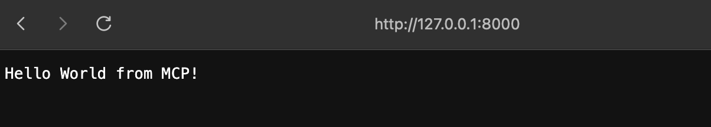

- [http://127.0.0.1:8000?name=krishna](http://127.0.0.1:8000?name=krishna)
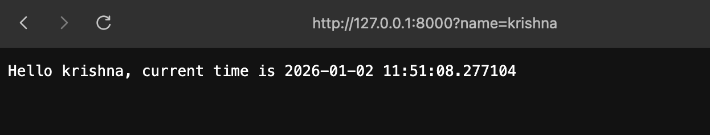

### Unit Testing

```bash
uv run pytest tests/maintests.py -v
```
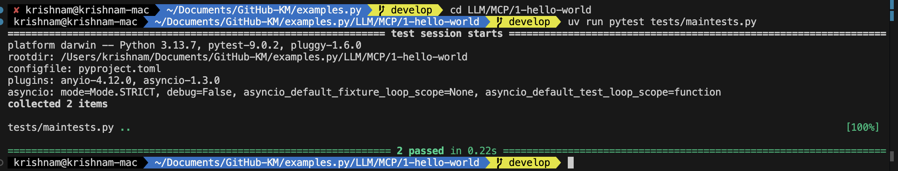

### Manual Testing via Curl (MCP Protocol)

To test the MCP protocol fully via `curl`, you need to simulate an MCP client. This involves two steps:

**1. Connect to SSE Stream**

Open a terminal and listen to the event stream:

```bash
curl -N http://127.0.0.1:8000/sse
```
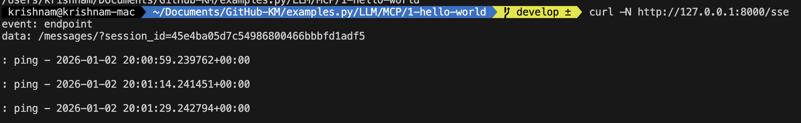

*Keep this running.* You will see an `endpoint` event containing a URL (e.g., `/messages/?session_id=...`). Copy this URL.

**2. Send JSON-RPC Requests**

In a **new terminal**, use the URL you copied to send requests.

**Initialize:**

```bash
curl -X POST "http://127.0.0.1:8000/messages/?session_id=123456" \
     -H "Content-Type: application/json" \
     -d '{
           "jsonrpc": "2.0",
           "id": 1,
           "method": "initialize",
           "params": {
             "protocolVersion": "2024-11-05",
             "capabilities": {},
             "clientInfo": { "name": "curl-client", "version": "1.0" }
           }
         }'
```
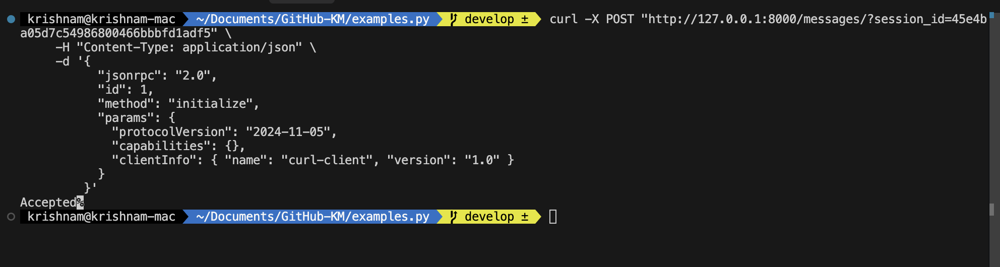

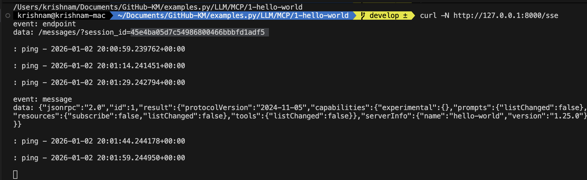


**List Tools:**

```bash
curl -X POST "http://127.0.0.1:8000/messages/?session_id=123456" \
     -H "Content-Type: application/json" \
     -d '{
           "jsonrpc": "2.0",
           "id": 2,
           "method": "tools/list"
         }'
```
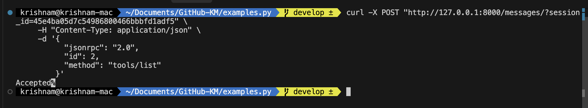
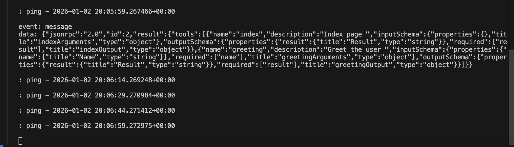

**Call Tool (index):**

```bash
curl -X POST "http://127.0.0.1:8000/messages/?session_id=123456" \
     -H "Content-Type: application/json" \
     -d '{
           "jsonrpc": "2.0",
           "id": 3,
           "method": "tools/call",
           "params": {
             "name": "index",
             "arguments": {}
           }
         }'
```

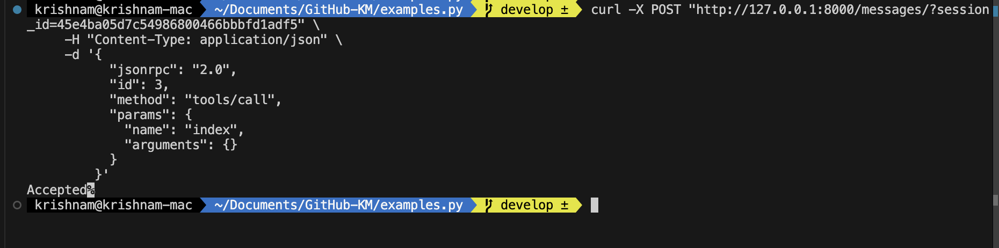
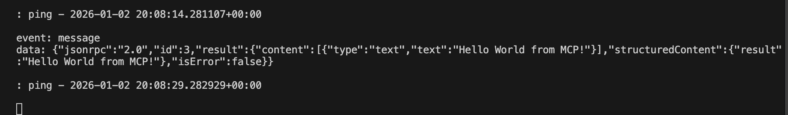

**Call Tool (greeting):**

```bash
curl -X POST "http://127.0.0.1:8000/messages/?session_id=123456" \
     -H "Content-Type: application/json" \
     -d '{
           "jsonrpc": "2.0",
           "id": 4,
           "method": "tools/call",
           "params": {
             "name": "greeting",
             "arguments": { "name": "Krishna" }
           }
         }'
```

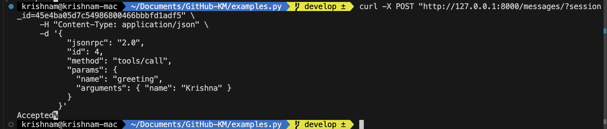
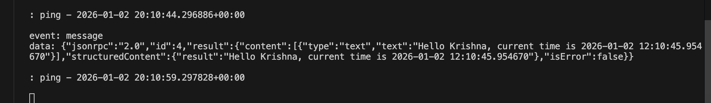

### MCP Inspector

The [MCP Inspector](https://github.com/modelcontextprotocol/inspector) is a developer tool for testing and debugging MCP servers.

Run the inspector (this uses `npx` to run the inspector, which then runs your server in `stdio` mode):

```bash
npx @modelcontextprotocol/inspector uv run src/main.py --transport stdio
```
