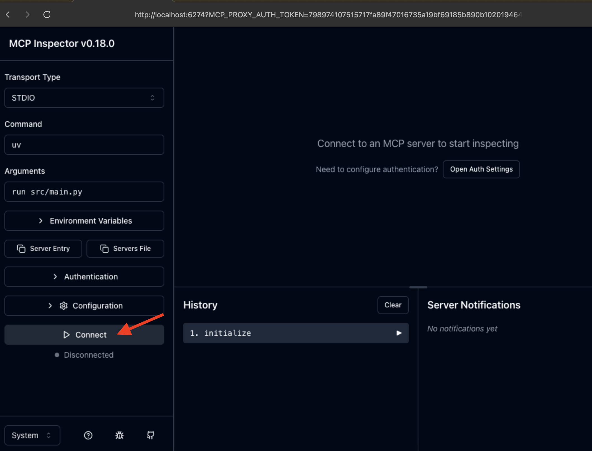
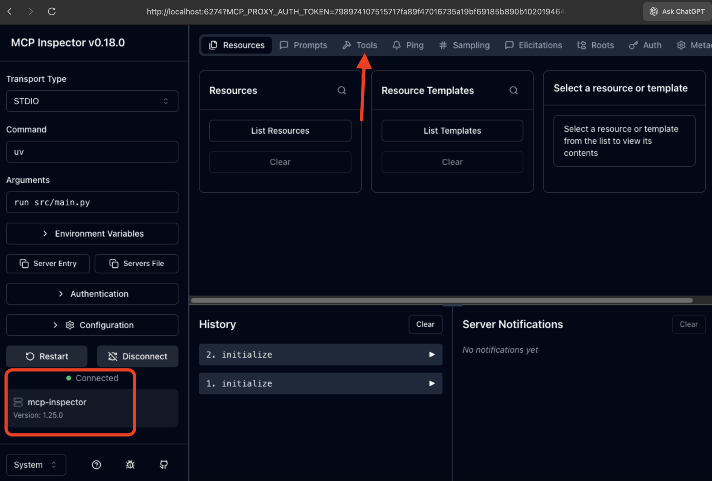
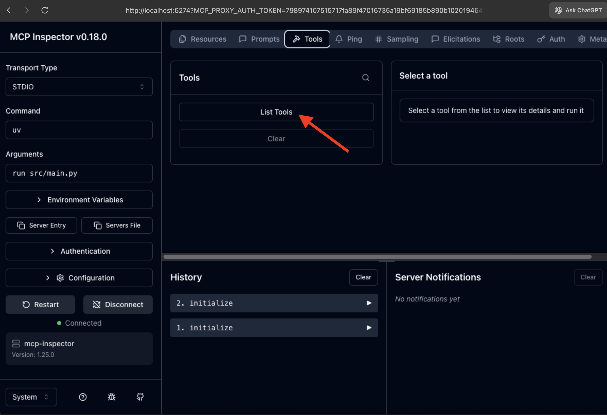
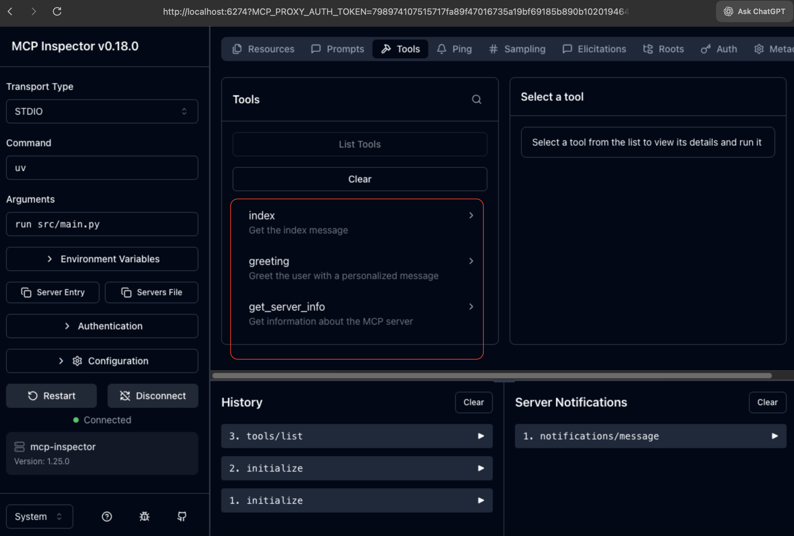
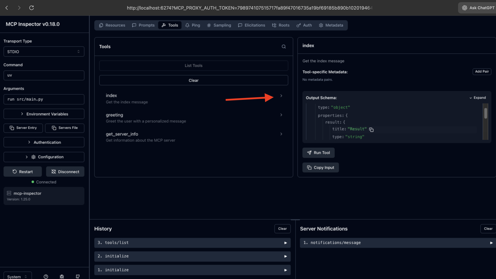
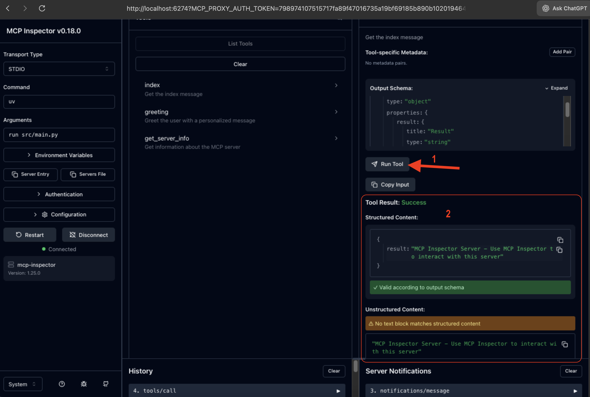

# MCP Inspector Example

This project demonstrates how to use the [MCP Inspector](https://github.com/modelcontextprotocol/inspector) to test and debug MCP servers. The MCP Inspector provides a web-based UI for interacting with your MCP server.

## Pre-requisites
- [uv](https://github.com/astral-sh/uv) (Fast Python package installer and resolver)
- [Node.js](https://nodejs.org/) (for running MCP Inspector via npx)

## Setup
Install dependencies:

```bash
uv sync
```

## Running with MCP Inspector

The MCP Inspector is a developer tool that provides a web-based interface for testing and debugging MCP servers.

### Start the MCP Inspector

Run the following command to start the MCP Inspector:

```bash
./mcp.sh start
```

**What happens:**
1. The MCP Inspector will start and launch your MCP server in `stdio` mode
2. A web browser will automatically open, or you can manually navigate to the URL shown in the terminal
3. The MCP Inspector typically runs on **http://localhost:5173** (or another port if 5173 is in use)

### Using the MCP Inspector

Once the Inspector opens in your browser, you can:

- **View Server Information**: See the server name, version, and capabilities
- **Connect**: Click on the Connect button
  
  
  
- **List Tools**: This server exposes the following tools:
    - **`index`**: Get the index message
    - **`greeting(name: str)`**: Greet the user with a personalized message
    - **`get_server_info()`**: Get information about the MCP server
  
  
  
  

## Additional Resources

- [MCP Inspector GitHub Repository](https://github.com/modelcontextprotocol/inspector)
- [MCP Protocol Documentation](https://modelcontextprotocol.io/)
