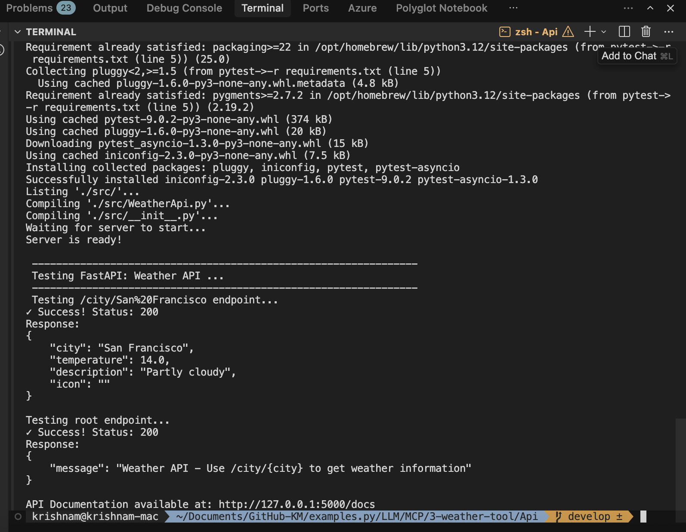
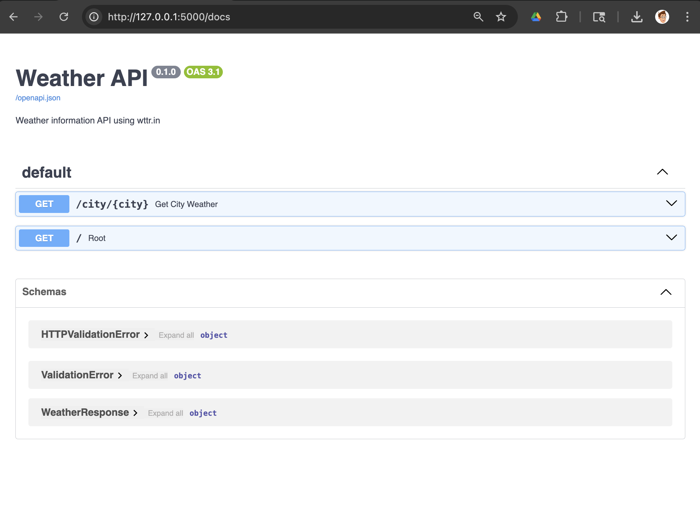
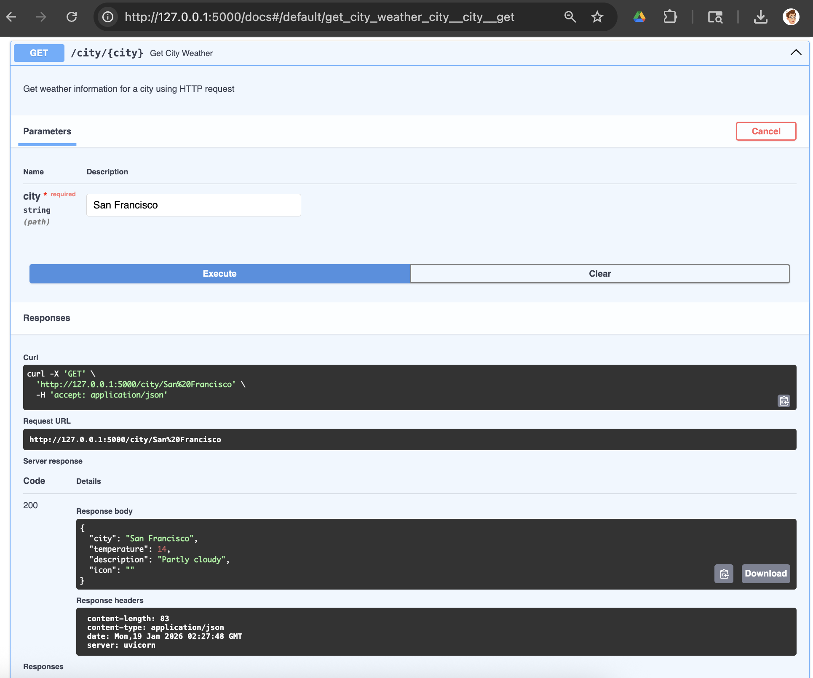
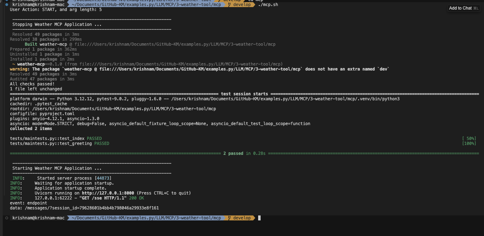
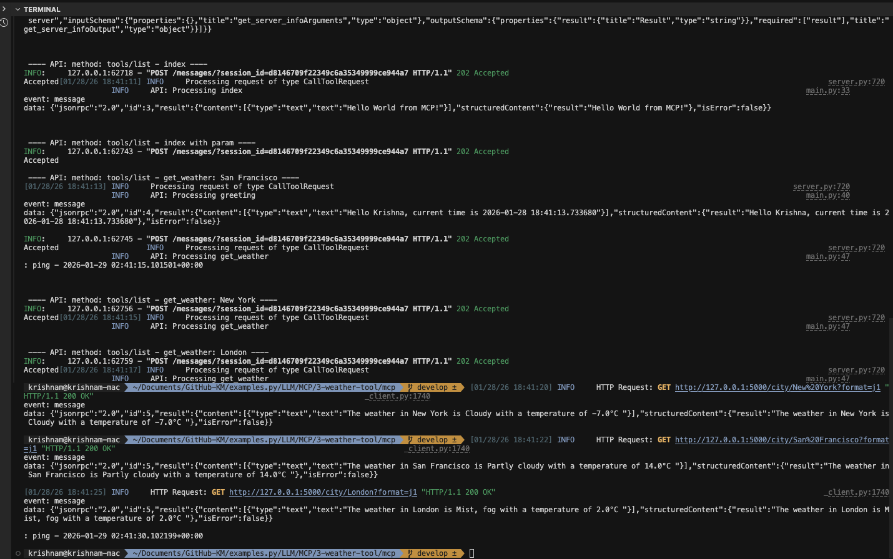

# Weather API - MCP Example

## Pre-requisites
- [uv](https://github.com/astral-sh/uv) (Fast Python package installer and resolver)

## API Service
### Run the API service
```bash
cd api
./api.sh 
```


### Test via browser





## MCP Server
Run the MCP server (configured to use SSE transport):

```bash
cd api 
uv run src/main.py
```


- The server will start on `http://127.0.0.1:8000`


## Testing

### Unit Testing

```bash
./mcp.sh test
```



### MCP Inspector

The [MCP Inspector](https://github.com/modelcontextprotocol/inspector) is a developer tool for testing and debugging MCP servers.

Run the inspector (this uses `npx` to run the inspector, which then runs your server in `stdio` mode):

```bash
npx @modelcontextprotocol/inspector uv run src/main.py --transport stdio
```
