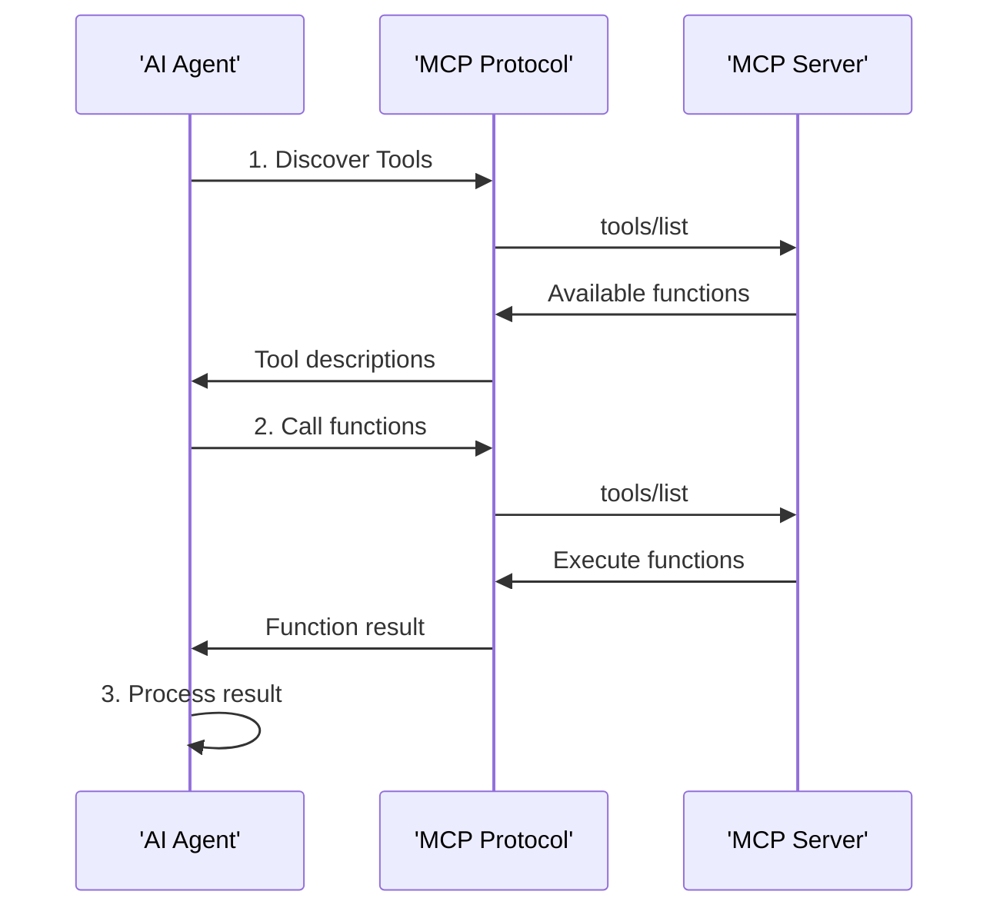

## What is MCP?
The Model Context Protocol (MCP) is an open standard that enables AI models to securely connect with external tools, data sources, and services. Instead of building custom integrations for each tool, MCP provides a universal interface.

## Communication Flow
The MCP protocol follows a request-response pattern:



## MCP Message Types
### 1. Tool Discovery
In order for AI models to take advantage of existing tools, it first needs to identify accessible tools.

#### Request: List available tools
```json
{
  "jsonrpc": "2.0",
  "id": 1,
  "method": "tools/list",
  "params": {}
}
```
#### Response: Available tools with descriptions
```json
{
  "jsonrpc": "2.0",
  "id": 1,
  "result": {
    "tools": [
      {
        "name": "add",
        "description": "Add two numbers together",
        "inputSchema": {
          "type": "object",
          "properties": {
            "x": {"type": "number"},
            "y": {"type": "number"}
          }
        }
      }
    ]
  }
}
```

### 2. Tool Execution
Next, the AI model will leverage tool calling capabilities to access external functions, APIs, or services when needed to complete tasks beyond their internal knowledge or capabilities.

#### Request: Call a specific tool
```json
{
  "jsonrpc": "2.0",
  "id": 2,
  "method": "tools/call",
  "params": {
    "name": "add",
    "arguments": {
      "x": 25,
      "y": 17
    }
  }
}
```

#### Response: Tool execution result
```json
{
  "jsonrpc": "2.0",
  "id": 2,
  "result": {
    "content": [
      {
        "type": "text",
        "text": "42"
      }
    ]
  }
}
```


## Transport Methods
MCP supports different transport mechanisms:


| Transport | Description | Use Case | 
| :--  | :--  | :--  |  
| stdio | Standard input/output | Local development, simple setup | 
| HTTP | HTTP requests | Web services, remote tools | 
| WebSocket | Real-time communication | Interactive applications | 


## Integration with AI Models
AI models interact with MCP through tool-calling capabilities:

- Tool Discovery: Model requests available tools
- Intent Recognition: Model matches user query to appropriate tools
- Parameter Extraction: Model extracts parameters from natural language
- Tool Execution: Model calls tools with structured parameters
- Result Integration: Model incorporates results into response